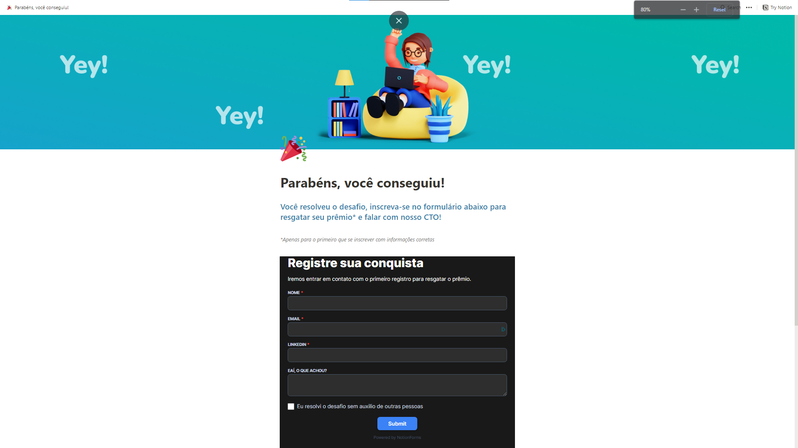

Curte educação e resolver problemas complexos?

A Layers Education está construindo o maior sistema operacional da educação brasileira com o objetivo de democratizar o acesso à tecnologia em instituições de ensino. Eles estão em busca de novos profissionais e trouxeram um desafio para os leitores aqui na Newsletter: 

Uma mensagem passada por Júlio César em Roma foi: "Acesse myyux://qnsp.qfdjwx.jizhfynts/ijxhmhjxfw" A primeira pessoa a resolver o desafio leva uma Alexa e ainda bate um papo direto com o CTO da Layers!

## Passo 1: ROT 21

myyux://qnsp.qfdjwx.jizhfynts/ijxhmhjxfw => ROT 21 => https://link.layers.education/deschcesar => https://layers.notion.site/C-sar-est-orgulhoso-5e66586238ac4e97bdd9603a0f314bf0

Conteúdo da página página:

Acesse:  
https://link.layers.education/w?cc?9x?

SHA256:  
76949a35477f8b8f5e35c50d3006c01dbc4515bb744d88f0b636bc5f2fc20756

Boa sorte 👀

## Passo 2: força bruta

 1. Gerar todas as combinações de letras e dígitos (3 caracteres)
 2. Substituir os '?' da URL pelos caracteres gerados
 3. Calcular o SHA256 da nova URL
 4. Comparar com o hash fornecido

 Solução encontrada após 207.203 tentativas!

 => https://link.layers.education/wrcct9xy

 